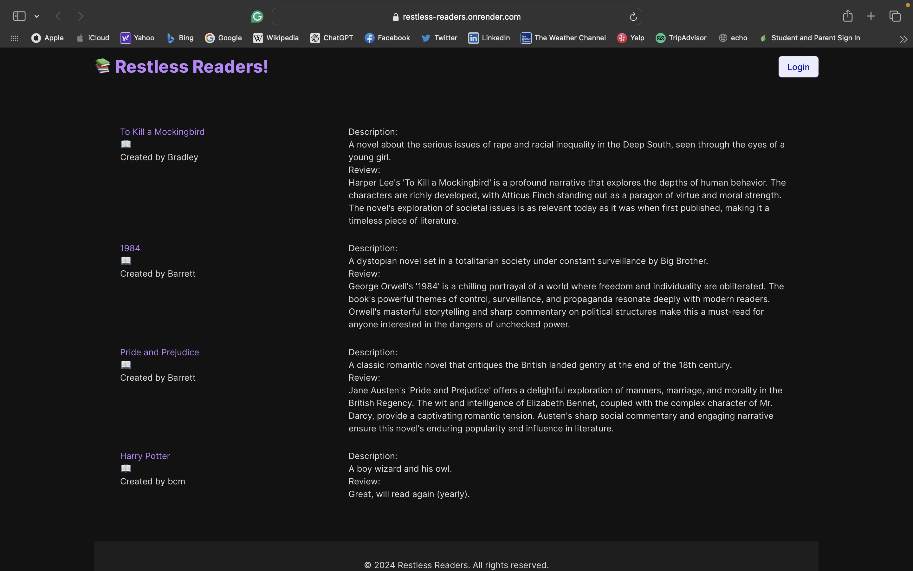

# RESTless Readers

RESTless Readers is an interactive full-stack web application where users can join and participate in book clubs. The platform allows users to create accounts, login, create and view posts about specific books, and schedule and attend book club meetings.

## Specifications

### Database Models

- **User**
  - `id`: primary key
  - `username`: unique identifier for the user
  - `email`: user's email address
  - `password`: hashed password

- **Book**
  - `id`: primary key
  - `name`: name of the book
  - `description`: description of the book
  - `review`: user reviews of the book
  - `user_id`: foreign key that references `User.id`

- Users have many books, and books belong to a user.
  - If a user is deleted, all associated books are also deleted.

## Concept of Designs

### User Story

As a user, I want to join and participate in book clubs, so I can share my love of reading with others.

### Features

- **Create an account on the book club or log in**
  - A new user should be able to create a new account.
  - An existing user should be able to auth an existing account.

- **Create, view, and discuss specific books**
  - A user should be able to create a post around a specific book.
  - A user should be able to view existing book posts.
  - A user should be able to click into a book title to see expanded details.

- **Schedule and attend book club meetings**
  - A user should be able to schedule the next meeting date.

## Technologies Used

- Node.js
- Express.js
- Handlebars.js
- PostgreSQL
- Sequelize ORM
- Bulma CSS Framework

## Installation

1. Clone the repository:
    ```bash
    git clone https://github.com/bragonese1/restless-readers.git
    cd restless-readers
    ```

2. Install dependencies:
    ```bash
    npm install
    ```

3. Set up environment variables:
    ```bash
    cp .env.example .env
    ```
   Update `.env` with your database credentials and other configurations.

4. Create the database:
    ```bash
    npx sequelize-cli db:create
    npx sequelize-cli db:migrate
    ```

5. Start the application:
    ```bash
    npm start
    ```

## Usage

- Navigate to `http://localhost:3001` in your browser to access the application.

## Deployed Application

The application is deployed at: [Deployed Application URL](https://restless-readers.onrender.com)

## Screenshots



## Contributing

1. Fork the repository.
2. Create a new branch (`git checkout -b feature-branch`).
3. Make your changes and commit them (`git commit -m 'Add new feature'`).
4. Push to the branch (`git push origin feature-branch`).
5. Open a Pull Request.

## License

This project is licensed under the MIT License.

## Contact

For any questions or inquiries, please contact us at [restlessapis@gmail.com](mailto:restlessapis@gmail.com).

## Acknowledgements

This project is developed as part of the Restless-APIs Team.

---
© 2024 Restless Readers. Confidential and Proprietary. All Rights Reserved.
